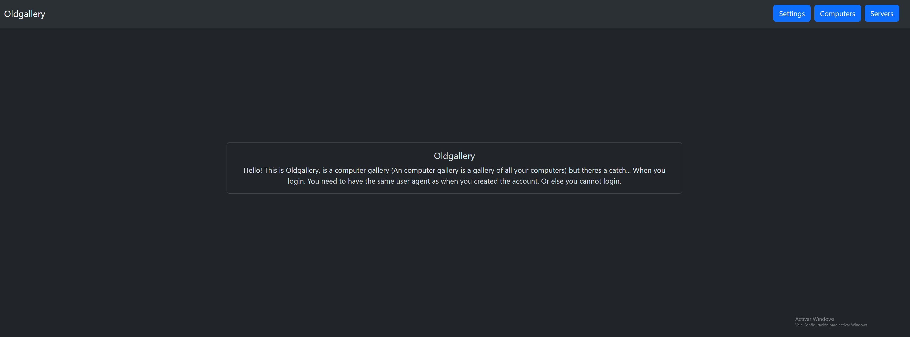

# Oldgallery



## Oldgallery is a computer gallery (An computer gallery is a gallery of all your computers.)

# But....

## When you login you need to type your user agent when you log in.
The ui dosent look great in phones soo

# How to run
Just run:
```bash
pip install -r requirements.txt
python ./main.py
```

# Vulnearvility:
You can view/change the user agent with a extension

# Made for [Authly](https://authly.hackclub.com/home.html)